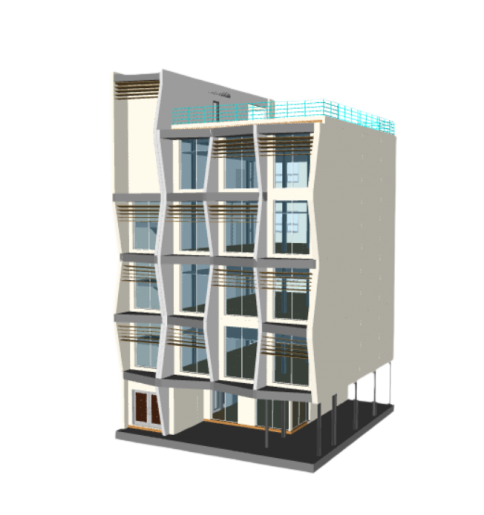
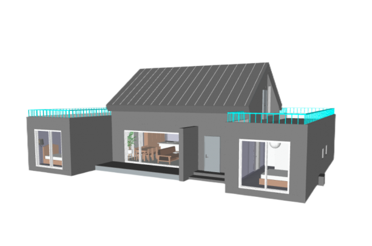

<<<<<<< HEAD

# ⬡ BIMXR — IFC Web Viewer

<div align="center">

**A browser-based, WebXR-ready IFC building model viewer built on [A-Frame](https://aframe.io/) and [web-ifc-three](https://github.com/IFCjs/web-ifc-three).**

[](LICENSE)
[](#supported-formats)
[](#webxr--vr-mode)
[](https://aframe.io/)

</div>

---

## Overview

BIMXR is a lightweight, zero-install web application that lets architects, engineers, and construction professionals open and explore IFC (Industry Foundation Classes) building models directly in the browser — no plugins required. Models can be inspected in classic 3D orbit mode, walked through in first-person, or experienced in immersive VR via WebXR.

---

## ✨ Features

### 📂 File Loading

- **Open local IFC files** — drag-and-drop or use the file picker
- **Sample model** — instantly load a bundled architectural IFC to try the viewer
- **Schema validation** — supports IFC2X3, IFC4, and IFC4X3; warns on unsupported schemas

### 🔭 3D Orbit Viewer

- Smooth left-click orbit, right-click pan, scroll zoom
- Animated camera transitions to standard views (**Top, Front, Right, Home**)
- Interactive **View Cube** — click any face or corner to snap to that direction
- Background colour picker and scene reset

### 🚶 First-Person Walker

- WASD / arrow-key movement with navmesh constraint (stays on floors)
- Mouse-look drag controls
- On-screen directional pad (mobile-friendly)
- Avatar (body silhouette) shown while walking
- Live **floor elevation status** display — nearest storey detected automatically

### 🏢 Floor Navigation

- Automatic floor/storey detection from the IFC spatial structure
- Floor dropdown with elevation labels — teleport instantly to any storey

### 👁️ Visibility Controls

- Toggle **slab and ceiling** transparency to see inside floors
- Show / hide **MEP systems** per floor level
- Show / hide **structural beams** per reference level
- Click-to-inspect toggle

### 🔍 Element Inspection

- Click any building element to open the **Properties panel**
  - Element type badge and category
  - Full IFC property sets rendered as tables
- **IFC Schema Tree** — hierarchical spatial structure browser in the left panel
- **Space Info** panel — room name, level, and finish information

### 🌐 WebXR / VR Mode

- Enter immersive VR on compatible headsets (Meta Quest, etc.)
- DOM overlay UI remains usable inside VR
- 6DOF hand controllers with ray-cast selection
- Thumbstick locomotion

### 🗺️ Additional Tools

- **Floor plan overlay** generation
- **Memo / annotation** system for leaving notes on elements
- **Cost range** tagging
- **Search by date** / task workflow utilities
- **Tooltip** system for element names
- **jsPDF** integration for report export

---

## 🖼️ Screenshots

| 3D Orbit View                             | First-Person Walk                           |
| ----------------------------------------- | ------------------------------------------- |
|  |  |

---

## 🛠️ Technology Stack

| Technology                                              | Role                                    |
| ------------------------------------------------------- | --------------------------------------- |
| [A-Frame 1.4.1](https://aframe.io/)                     | 3D scene, WebXR runtime                 |
| [web-ifc](https://github.com/IFCjs/web-ifc)             | IFC geometry parser (WASM)              |
| [web-ifc-three](https://github.com/IFCjs/web-ifc-three) | Three.js IFC loader & subset management |
| [Three.js](https://threejs.org/)                        | 3D rendering                            |
| [jsPDF](https://github.com/parallax/jsPDF)              | PDF export                              |
| OpenCV.js                                               | (vision utilities)                      |
| jQuery                                                  | DOM utilities                           |

---

## Supported Formats

| Schema | Status           |
| ------ | ---------------- |
| IFC2X3 | ✅ Full support  |
| IFC4   | ✅ Full support  |
| IFC4X3 | ✅ Full support  |
| Other  | ⚠️ Warning shown |

---

## 🚀 Getting Started

### Prerequisites

- Node.js ≥ 16
- npm

### Install & Build

```bash
# Install dependencies (from workspace root containing node_modules)
npm install

# Build the bundle
npm run build

# Watch mode (rebuilds on change)
npm run watch
```

### Run locally

Serve the project with any static file server, e.g.:

```bash
npx serve .
# or
python -m http.server 8080
```

Then open `http://localhost:8080` in a modern browser (Chrome, Edge, or Firefox recommended).

> **Note:** The WASM files (`web-ifc.wasm`, `web-ifc-mt.wasm`) and IFC worker must be present in `assets/js/`. The `npm run build` step copies them automatically via `copy-runtime`.

---

## 🗂️ Project Structure

```
IFC_Web_Viewer/
├── index.html              # Main application (single-page)
├── package.json
└── assets/
    ├── css/
    │   └── app.css         # Dark-theme UI styles (Revit-inspired)
    ├── images/             # Button icons and preview images
    └── js/
        ├── bundle.js       # Compiled Three.js + IFC loader bundle
        ├── buttons.js      # Ribbon button logic
        ├── cursor_click.js # Element selection & ray-cast click
        ├── select.js       # Subset selection helpers
        ├── overlay.js      # UI overlay management
        ├── wasd.js         # Custom WASD movement controls
        ├── floorplan.js    # Floor plan generation
        ├── memo.js / memoWorks.js  # Annotation system
        ├── tooltip.js      # Element tooltips
        ├── costRange.js    # Cost tagging
        ├── searchDate.js   # Date-based search
        ├── task.js         # Task workflow
        ├── updateInfo.js   # Property panel updates
        └── ...
```

---

## ⌨️ Controls

### 3D Orbit Mode

| Action          | Control                                   |
| --------------- | ----------------------------------------- |
| Orbit           | Left-click + drag                         |
| Pan             | Right-click + drag or Middle-click + drag |
| Zoom            | Scroll wheel                              |
| Inspect element | Click                                     |

### Walk Mode

| Action            | Control                        |
| ----------------- | ------------------------------ |
| Move              | W / A / S / D or Arrow keys    |
| Look              | Click + drag                   |
| Up / Down         | E / Q                          |
| Teleport to floor | Navigate → Floor dropdown → Go |

---

## 🌍 Visitor Statistics

A flag counter is embedded in the live site (top-right globe icon &#127758;) to track international visitors. Click the icon to view country-level visit counts.

---

## 📄 License

# MIT © IFC.js contributors

# ⬡ BIMXR — IFC Web Viewer

<div align="center">

**A browser-based, WebXR-ready IFC building model viewer built on [A-Frame](https://aframe.io/) and [web-ifc-three](https://github.com/IFCjs/web-ifc-three).**

[](LICENSE)
[](#supported-formats)
[](#webxr--vr-mode)
[](https://aframe.io/)

</div>

---

## Overview

BIMXR is a lightweight, zero-install web application that lets architects, engineers, and construction professionals open and explore IFC (Industry Foundation Classes) building models directly in the browser — no plugins required. Models can be inspected in classic 3D orbit mode, walked through in first-person, or experienced in immersive VR via WebXR.

---

## ✨ Features

### 📂 File Loading

- **Open local IFC files** — drag-and-drop or use the file picker
- **Sample model** — instantly load a bundled architectural IFC to try the viewer
- **Schema validation** — supports IFC2X3, IFC4, and IFC4X3; warns on unsupported schemas

### 🔭 3D Orbit Viewer

- Smooth left-click orbit, right-click pan, scroll zoom
- Animated camera transitions to standard views (**Top, Front, Right, Home**)
- Interactive **View Cube** — click any face or corner to snap to that direction
- Background colour picker and scene reset

### 🚶 First-Person Walker

- WASD / arrow-key movement with navmesh constraint (stays on floors)
- Mouse-look drag controls
- On-screen directional pad (mobile-friendly)
- Avatar (body silhouette) shown while walking
- Live **floor elevation status** display — nearest storey detected automatically

### 🏢 Floor Navigation

- Automatic floor/storey detection from the IFC spatial structure
- Floor dropdown with elevation labels — teleport instantly to any storey

### 👁️ Visibility Controls

- Toggle **slab and ceiling** transparency to see inside floors
- Show / hide **MEP systems** per floor level
- Show / hide **structural beams** per reference level
- Click-to-inspect toggle

### 🔍 Element Inspection

- Click any building element to open the **Properties panel**
  - Element type badge and category
  - Full IFC property sets rendered as tables
- **IFC Schema Tree** — hierarchical spatial structure browser in the left panel
- **Space Info** panel — room name, level, and finish information

### 🌐 WebXR / VR Mode

- Enter immersive VR on compatible headsets (Meta Quest, etc.)
- DOM overlay UI remains usable inside VR
- 6DOF hand controllers with ray-cast selection
- Thumbstick locomotion

### 🗺️ Additional Tools

- **Floor plan overlay** generation
- **Memo / annotation** system for leaving notes on elements
- **Cost range** tagging
- **Search by date** / task workflow utilities
- **Tooltip** system for element names
- **jsPDF** integration for report export

---

## 🖼️ Screenshots

| 3D Orbit View                             | First-Person Walk                           |
| ----------------------------------------- | ------------------------------------------- |
|  |  |

---

## 🛠️ Technology Stack

| Technology                                              | Role                                    |
| ------------------------------------------------------- | --------------------------------------- |
| [A-Frame 1.4.1](https://aframe.io/)                     | 3D scene, WebXR runtime                 |
| [web-ifc](https://github.com/IFCjs/web-ifc)             | IFC geometry parser (WASM)              |
| [web-ifc-three](https://github.com/IFCjs/web-ifc-three) | Three.js IFC loader & subset management |
| [Three.js](https://threejs.org/)                        | 3D rendering                            |
| [jsPDF](https://github.com/parallax/jsPDF)              | PDF export                              |
| OpenCV.js                                               | (vision utilities)                      |
| jQuery                                                  | DOM utilities                           |

---

## Supported Formats

| Schema | Status           |
| ------ | ---------------- |
| IFC2X3 | ✅ Full support  |
| IFC4   | ✅ Full support  |
| IFC4X3 | ✅ Full support  |
| Other  | ⚠️ Warning shown |

---

## 🚀 Getting Started

### Prerequisites

- Node.js ≥ 16
- npm

### Install & Build

```bash
# Install dependencies (from workspace root containing node_modules)
npm install

# Build the bundle
npm run build

# Watch mode (rebuilds on change)
npm run watch
```

### Run locally

Serve the project with any static file server, e.g.:

```bash
npx serve .
# or
python -m http.server 8080
```

Then open `http://localhost:8080` in a modern browser (Chrome, Edge, or Firefox recommended).

> **Note:** The WASM files (`web-ifc.wasm`, `web-ifc-mt.wasm`) and IFC worker must be present in `assets/js/`. The `npm run build` step copies them automatically via `copy-runtime`.

---

## 🗂️ Project Structure

```
IFC_Web_Viewer/
├── index.html              # Main application (single-page)
├── package.json
└── assets/
    ├── css/
    │   └── app.css         # Dark-theme UI styles (Revit-inspired)
    ├── images/             # Button icons and preview images
    └── js/
        ├── bundle.js       # Compiled Three.js + IFC loader bundle
        ├── buttons.js      # Ribbon button logic
        ├── cursor_click.js # Element selection & ray-cast click
        ├── select.js       # Subset selection helpers
        ├── overlay.js      # UI overlay management
        ├── wasd.js         # Custom WASD movement controls
        ├── floorplan.js    # Floor plan generation
        ├── memo.js / memoWorks.js  # Annotation system
        ├── tooltip.js      # Element tooltips
        ├── costRange.js    # Cost tagging
        ├── searchDate.js   # Date-based search
        ├── task.js         # Task workflow
        ├── updateInfo.js   # Property panel updates
        └── ...
```

---

## ⌨️ Controls

### 3D Orbit Mode

| Action          | Control                                   |
| --------------- | ----------------------------------------- |
| Orbit           | Left-click + drag                         |
| Pan             | Right-click + drag or Middle-click + drag |
| Zoom            | Scroll wheel                              |
| Inspect element | Click                                     |

### Walk Mode

| Action            | Control                        |
| ----------------- | ------------------------------ |
| Move              | W / A / S / D or Arrow keys    |
| Look              | Click + drag                   |
| Up / Down         | E / Q                          |
| Teleport to floor | Navigate → Floor dropdown → Go |

---

## 🌍 Visitor Statistics

A flag counter is embedded in the live site (top-right globe icon &#127758;) to track international visitors. Click the icon to view country-level visit counts.

---

## 📄 License

MIT © IFC.js contributors

> > > > > > > 60d0842e2daaf41b1305055682834727b3d022a0
